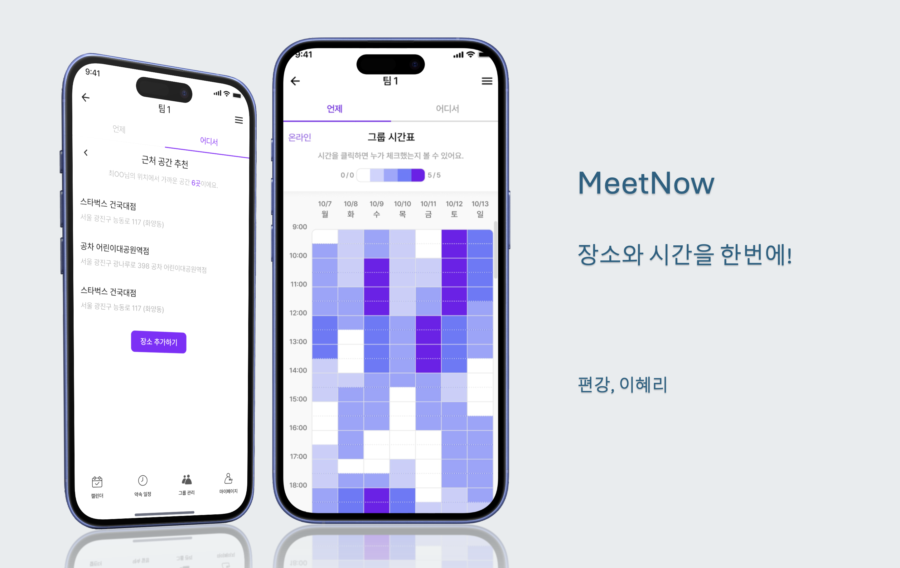

# 📖 Meetnow 밋나우 

- 배포 URL : 
- Test ID : 
- Test PW : 

 

## 프로젝트 소개

- Meetnow는 그룹의 장소 및 시간을 한 번에 정할 수 있는 플랫폼입니다.
- 장소 추천시 사용자 정보 보호를 위해 사용자 히스토리에 비식별화,가명처리,암호화 부분을 구현해 보다 높은 수준의 보안을 제공합니다.

 

## 팀원 구성

|                                                                **편강**                                                                 |                                                                  **이혜리**                                                                   |
|:-------------------------------------------------------------------------------------------------------------------------------------:|:------------------------------------------------------------------------------------------------------------------------------------------:|
| [   gongPyeon](https://github.com/gongPyeon) |    [   Hyeri1ee](https://github.com/Hyeri1ee)    |

 

## 1. 개발 환경 및 인프라

   

## 2. 트러블 슈팅

   